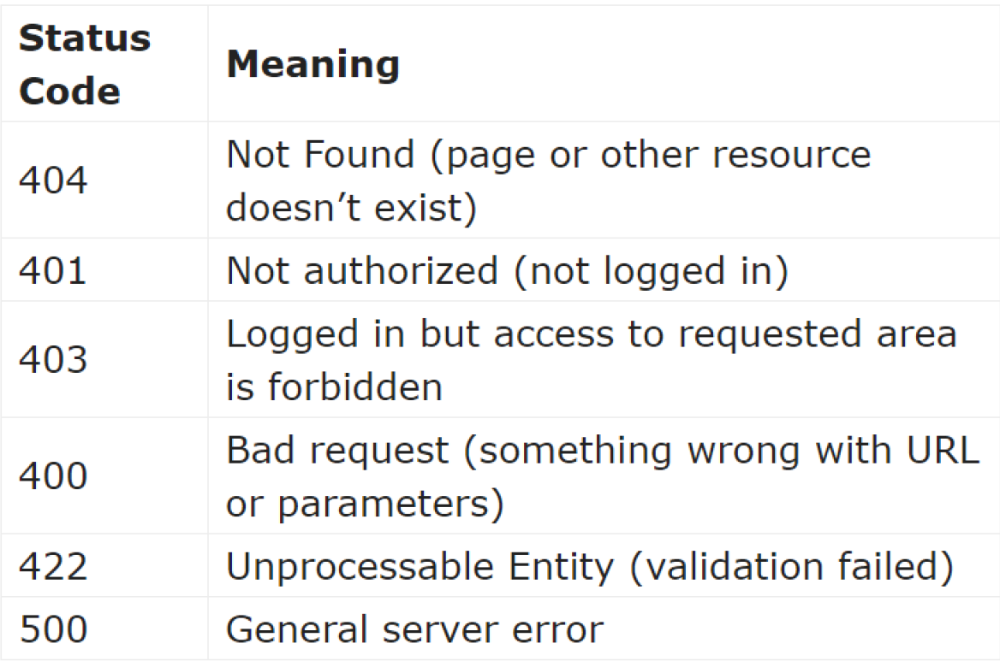

#استاندارد مدیریت خطاها و استثناها
###1- لیست کدهای خطا


### 2-مقدار APP_DEBUG در فایل .env در پروداکشن باید false  باشد.

### 3-براي مدیریت پیغام خطاي مربوط به نبود یا اشتباه بودن یک روت (خطای NOT FOUND) در فایل routes/api بهتر است مورد زیر اضافه شود
```
    Route::fallback(function(){
        return response()->json([
            'message' => 'Page Not Found. If error persists, contact info@website.com'], 404);
    });
```
### 4-مدیریت خطاي 404 مربوط به عدم وجود مدل
این خطا معمولا با 
`ModelName::findOrFail($id)`
یا
`$query->firstOrFail()`
ممدیریت میشود اما میتوان براي مشخص کردن این امر که خطا دقیقا مربوط به پیدا نشدن کدام مدل است، این خطا را کاستومایز کرد
به این آدرس میرویم :
`app/Exceptions/Handler.php`
این مورد را در ابتداي فایل اضافه میکنیم :
`use Illuminate\Database\Eloquent\ModelNotFoundException;`
سپس خط کدهای زیر را به تابع render اضافه می کنیم:
```
public function render($request, Exception $exception)
{
    if ($exception instanceof ModelNotFoundException) {
        return response()->json([
            'error' => 'Entry for '.str_replace('App\\', '', $exception->getModel()).' not found'], 404);
    }
    return parent::render($request, $exception);
}
```
### 5-مدیریت تا حد ممکن خطا در مرحله اعتبارسنجی
بسیاری از خطاها مربوط به نوع داده، ارتباط داده ها با یکدیگر، فرمت درست داده،وجود و عدم وجود یک داده در پایگاه داده و مواردی از این قبیل در این مرحله می توانند مدیریت شوند.

### 6-استفاده از `try/catch` براي جلوگیري تا حد ممکن از ارسال کد500 یا خطای نامعلوم
مثللا:
```
try {
        $admin = User::find($request->email);
        $office = Office::create($request->all() + ['admin_id' => $admin->id]);
        (new UserService())->assignAdminToOffice($office);
} catch (ModelNotFoundException $ex) { // User not found
    abort(422, 'Invalid email: administrator not found');
} catch (Exception $ex) { // Anything that went wrong
    abort(500, 'Could not create office or assign it to administrator');
}

```

